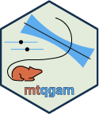

<style type="text/css">

img{
  border: none;
  margin: 5px;
}

</style>

```{r, include = FALSE}
knitr::opts_chunk$set(
  collapse = TRUE,
  comment = "#>"
)
```

```{r setup, include=F}
library(mtqgam)
library(itsadug)
library(qgam)
library(ggplot2)
```

```{r include=F}
# all not shown stuff

load("C:/Users/Adomo/Dropbox/HHU_2373/PhD/Experiment_02_+_03/01a_Analyse/qgams_x.RData")
tmp.x.1 <- qdo(qgams_x, 0.1)

```

<div class="logo">

  

</div>

The `mtqgam` package was created to simplify working with mouse-tracking data in QGAMs. Aiding the [ENGS](https://www.spoken-morphology.hhu.de/en/projects/engs-final-s-in-english-the-role-of-acoustic-detail-in-morphological-processing-and-learning) and the [VAR](https://www.spoken-morphology.hhu.de/en/projects/var-morpho-phonetic-variation-in-english) project of the [DFG-FOR 2373 "Spoken Morphology"](https://www.spoken-morphology.hhu.de/) research unit, this package is under development.

This vignette gives an overview of functions included in the `mtqgam` package. Please [contact the author](mailto:dominic.schmitz@hhu.de) in case of questions.

---

# Overview

This is a full list of all functions currently contained in `SfL`:

- [better_parametric_plot](#better_parametric_plot)
- [better_smooth_plot](#better_smooth_plot)
- [extract_x](#extract_x)
- [extract_y](#extract_y)

Note: Due to size reasons, no exemplary data set is included in this package.

---

# Better Parametric Plots {#better_parametric_plot}

The `better_parametric_plot` function creates a point-range plot for the specified parametric predictor term. It basically is a wrapper for `itsadug`'s `plot_parametric` function, adding the variability and flexibility of `ggplot2` objects.

The functions requires the output of a `plot_parametric` call as well as the `pred` argument given for that call.

```{r fig.align='center'}
# create an 'old' parametric plot
old.plot <- plot_parametric(tmp.x.1, pred=list(Condition=c("matched", "mismatched")), print.summary=F)
```


```{r fig.align='center'}
# create a better parametric plot using the 'old' plot
better_parametric_plot(parametric_plot = old.plot, pred=list(Condition=c("matched", "mismatched")))
```

You can change the order of the predictor levels displayed on the y axis:

```{r fig.align='center'}
better_parametric_plot(parametric_plot = old.plot, pred=list(Condition=c("matched", "mismatched")),
                       order = c("mismatched", "matched"))
```

Plots created with `better_parametric_plot` can be modified using common `ggplot2` functions:

```{r fig.align='center'}
better_parametric_plot(parametric_plot = old.plot, pred=list(Condition=c("matched", "mismatched")),
                       color = c("purple", "blue")) +
                       theme_classic() +
                       labs(subtitle = "This is a subtitle")
```

---

# Better Smooth Plots {#better_smooth_plot}

The `better_smooth_plot` function creates a line plot for the specified parametric predictor term. It basically is a wrapper of the base R `plot` function used for the visualisation of GAMs, adding the variability and flexibility of `ggplot2` objects.

The functions requires a QGAM model fitted with `qgam::qgam` or `qgam:mqgam` as well as the `smooth_term` that is to be plotted.

```{r fig.align='center'}
# create a better smooth plot
better_smooth_plot(qgam = tmp.x.1, smooth_term = "order")
```

Plots created with `better_smooth_plot` can be modified using common `ggplot2` functions:

```{r fig.align='center'}
better_smooth_plot(qgam = tmp.x.1, smooth_term = "order",
                   fill = "purple") +
                   theme_classic() +
                   labs(title = "This is a title")
```

---

# Extract x Coordinates

The `extract_x` extracts the x coordinates from a time-normalized `mousetrap` object.

The function requires time-normalized mouse-tracking data, an ID column as part of the time-normalized data set, and the number of timestamps used for time-normalizing.

```{r eval=F}
# extract time-normalized data
tn_tracks <- as.data.frame(mt_data$tn_trajectories)

# add ID columns
tn_tracks$ID <- mt_data$data$ID

# use function
extract_x(tn_data = tn_tracks,
ID_column = tn_tracks$ID,
timestamps = 138)
```

---

# Extract y Coordinates

The `extract_y` extracts the y coordinates from a time-normalized `mousetrap` object.

The function requires time-normalized mouse-tracking data, an ID column as part of the time-normalized data set, and the number of timestamps used for time-normalizing.

```{r eval=F}
# extract time-normalized data
tn_tracks <- as.data.frame(mt_data$tn_trajectories)

# add ID columns
tn_tracks$ID <- mt_data$data$ID

# use function
extract_x(tn_data = tn_tracks,
ID_column = tn_tracks$ID,
timestamps = 138)
```

---

# References

Csárdi, G. (2021). cli: Helpers for Developing Command Line Interfaces. R package version 3.0.0. URL: https://CRAN.R-project.org/package=cli

Fasiolo M., Goude Y., Nedellec R., & Wood S. N. (2017). Fast calibrated additive quantile regression. URL: https://arxiv.org/abs/1707.03307

Hester, J. (2020). glue: Interpreted String Literals. R package version 1.4.1. https://CRAN.R-project.org/package=glue

Kieslich, P. J., Henninger, F., Wulff, D. U., Haslbeck, J. M. B., & Schulte-Mecklenbeck, M. (2019). Mouse-tracking: A practical guide to implementation and analysis. In M. Schulte-Mecklenbeck, A. Kühberger, & J. G. Johnson (Eds.), A Handbook of Process Tracing Methods (pp. 111-130). New York, NY: Routledge.

van Rij J, Wieling M, Baayen R, & van Rijn H (2020). itsadug: Interpreting Time Series and Autocorrelated Data Using GAMMs. R package version 2.4.

Wickham, H. (2016). ggplot2: Elegant Graphics for Data Analysis. Springer-Verlag New York.

Wickham, H. (2020). tidyr: Tidy Messy Data. R package version 1.1.2. https://CRAN.R-project.org/package=tidyr

---

Please message the author at dominic.schmitz@hhu.de in case of any questions, errors or ideas.


